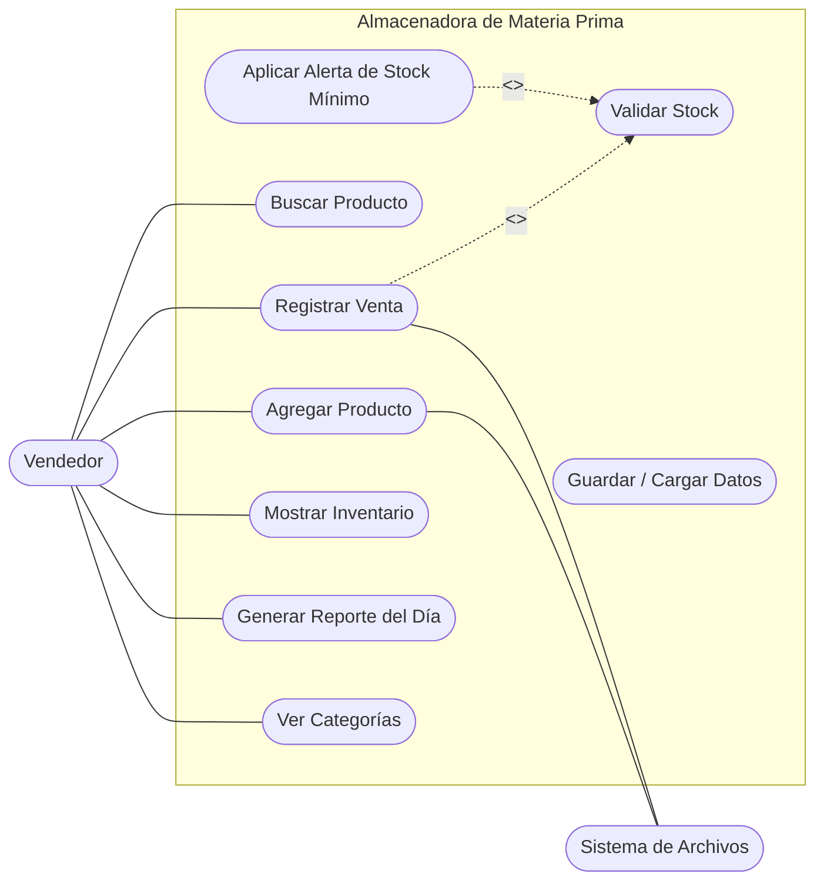

```mermaid
%%{init: {'theme': 'default'}}%%
flowchart LR
V([Vendedor])
S([Sistema de Archivos])

subgraph Almacenadora de Materia Prima
UC1([Agregar Producto])
UC2([Buscar Producto])
UC3([Registrar Venta])
UC4([Validar Stock])
UC5([Aplicar Alerta de Stock Mínimo])
UC6([Mostrar Inventario])
UC7([Generar Reporte del Día])
UC8([Ver Categorías])
UC9([Guardar / Cargar Datos])
end

V --- UC1
V --- UC2
V --- UC3
V --- UC6
V --- UC7
V --- UC8

UC3 -. "<<include>>" .-> UC4
UC5 -. "<<extend>>" .-> UC4

UC1 --- S
UC3 --- S
```