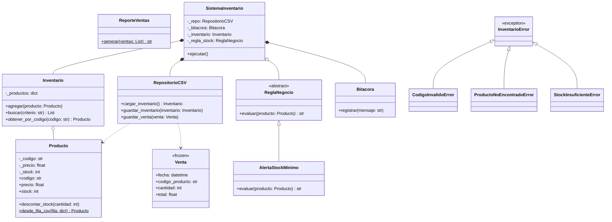

```mermaid
classDiagram
class Producto {
-_codigo: str
-_precio: float
-_stock: int
+codigo: str
+precio: float
+stock: int
+descontar_stock(cantidad: int)
+desde_fila_csv(fila: dict)$ Producto
}

class Venta {
<<frozen>>
+fecha: datetime
+codigo_producto: str
+cantidad: int
+total: float
}

class Inventario {
-_productos: dict
+agregar(producto: Producto)
+buscar(criterio: str) List
+obtener_por_codigo(codigo: str) Producto
}

class ReglaNegocio {
<<abstract>>
+evaluar(producto: Producto)* str
}

class AlertaStockMinimo {
+evaluar(producto: Producto) str
}

class RepositorioCSV {
+cargar_inventario() Inventario
+guardar_inventario(inventario: Inventario)
+guardar_venta(venta: Venta)
}

class Bitacora {
+registrar(mensaje: str)
}

class ReporteVentas {
+generar(ventas: List)$ str
}

class SistemaInventario {
-_repo: RepositorioCSV
-_bitacora: Bitacora
-_inventario: Inventario
-_regla_stock: ReglaNegocio
+ejecutar()
}

class InventarioError {
<<exception>>
}
class CodigoInvalidoError
class ProductoNoEncontradoError
class StockInsuficienteError

InventarioError <|-- CodigoInvalidoError
InventarioError <|-- ProductoNoEncontradoError
InventarioError <|-- StockInsuficienteError

ReglaNegocio <|-- AlertaStockMinimo
SistemaInventario *-- Inventario
SistemaInventario *-- RepositorioCSV
SistemaInventario *-- Bitacora
SistemaInventario o-- ReglaNegocio
Inventario o-- Producto
RepositorioCSV ..> Producto
RepositorioCSV ..> Venta
```